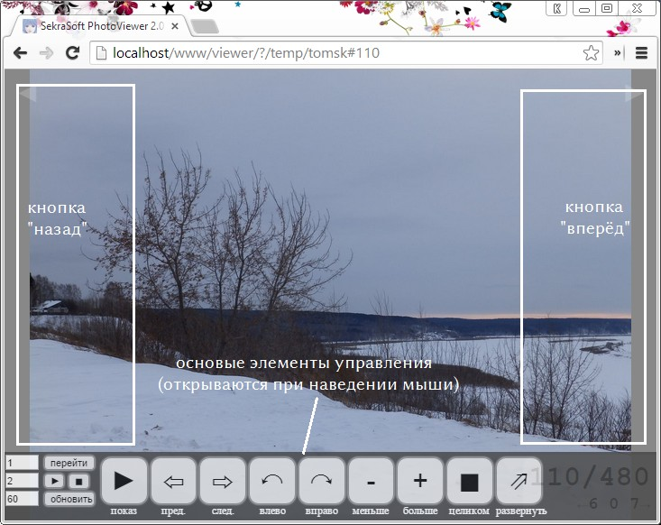

# Sekrasoft Photo Viewer 2
Позволяет просматривать фотографии из указанной папки на сервере.
Просмотрщик находит на указанной веб-странице все ссылки на картинки, после чего
подгружает и показывает их.

## Быстрый старт
  - Поместите просмотрщик на сайт, скажем, в `http://example.test/viewer/`
  - Смотрите изображения, просто добавив адрес: чтобы посмотреть `http://example.test/myimages`, откройте `http://example.test/viewer/?/myimages`

## Особенности
  - Управление с помощью клавиатуры/мыши/сенсорного экрана
  - Показ слайдов
  - Изменение масштаба, сдвиг и поворот с запоминанием
  - Автоматическое растягивание картинки на весь экран
  - Полноэкранный режим
  - Автоматическое обновление списка файлов
  - Умная подгрузка изображений с подстройкой под условия сети

## Внешний вид
**Вы также можете посмотреть [демонстрацию](https://rawgit.com/sekrasoft/js-viewer/master/index.html?examples/list.html) просмотрщика.**
### При просмотре изображений

### Панель управления

### Справка

### Подстройка под размер окна

